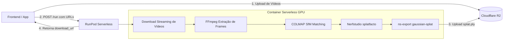

# 🚀 Pipeline Serverless 3DGS (Multi-Vídeo → Cloudflare R2)

Pipeline serverless automatizado no **RunPod** para reconstrução 3D com **Gaussian Splatting (3DGS)** utilizando **Nerfstudio (splatfacto)** e **COLMAP (SfM)** a partir de um ou múltiplos vídeos enviados pelo seu frontend e salvos diretamente no **Cloudflare R2**.

---

## 📌 Arquitetura do Sistema



* **Zero Custo Ocioso:** Os workers da GPU iniciam sob demanda ao receber a requisição e são desligados automaticamente ao finalizar o processamento.
* **Múltiplos Vídeos ou Vídeo Único:** O sistema aceita qualquer quantidade de vídeos (`.mp4`, `.mov`, etc.), extraindo e alinhando os frames em um único espaço 3D coordenado.
* **Integração Nativa com Cloudflare R2:** Baixa os vídeos e envia o `.ply` final com URL pré-assinada de 7 dias e link direto para o domínio público/CDN do R2.

---

## 📂 Estrutura do Repositório

```
pipeline-3dgs-serverless/
├── .github/
│   └── workflows/
│       └── docker.yml       # Compilação e envio automático para o Docker Hub
├── Dockerfile               # Imagem base PyTorch 2.4.1 + CUDA 12.4 + Nerfstudio 1.1.5 + gsplat
├── process.sh               # Motor bash: ffmpeg -> COLMAP -> splatfacto -> ns-export
├── handler.py               # Handler Serverless do RunPod integrado com Cloudflare R2
├── client_test.py           # Script Python para disparar e monitorar testes
├── .env.example             # Modelo das variáveis de ambiente necessárias
└── .gitignore               # Arquivos ignorados pelo Git
```

---

## 🛠️ Passo 1: Configuração dos Secrets no GitHub

Para que o GitHub Actions compile sua imagem Docker e envie ao Docker Hub sem você precisar de Docker instalado na sua máquina:

1. Acesse o repositório no GitHub: `https://github.com/lucasHashi/pipeline-3dgs-serverless`
2. Vá em **Settings** > **Secrets and variables** > **Actions** > **New repository secret**.
3. Crie os dois segredos abaixo:
   * `DOCKERHUB_USERNAME`: Seu nome de usuário no Docker Hub.
   * `DOCKERHUB_TOKEN`: Seu Personal Access Token do Docker Hub (gerado em *Docker Hub > Account Settings > Security > New Access Token*).

---

## ⚙️ Passo 2: Compilação Automatizada da Imagem

Ao fazer o `git push` para a branch `main`, o GitHub Actions compilará a imagem automaticamente:

* O workflow usa **wheels pré-compilados do gsplat**, reduzindo o tempo de compilação de ~25 minutos para ~6-8 minutos.
* Você pode acompanhar o progresso na aba **Actions** do seu repositório no GitHub.
* A imagem final será disponibilizada como:
  ```text
  SEU_USUARIO_DOCKERHUB/3dgs-serverless:v1
  SEU_USUARIO_DOCKERHUB/3dgs-serverless:latest
  ```

---

## ☁️ Passo 3: Criando o Endpoint Serverless no RunPod

1. Entre no painel do [RunPod](https://www.runpod.io/) e navegue até **Serverless** > **Endpoints** > **+ New Endpoint**.
2. Preencha as configurações:
   * **Endpoint Name:** `pipeline-3dgs`
   * **GPU Model:** `NVIDIA RTX 4090` (24GB VRAM) ou `RTX A6000` / `A100`
   * **Min Workers:** `0` (custo zero quando não houver requisições)
   * **Max Workers:** `2` ou `3` (ou conforme sua demanda simultânea)
   * **Idle Timeout:** `5` segundos
   * **Execution Timeout:** `3600` segundos (1 hora - tempo suficiente para o pipeline completo)
   * **Container Image:** `SEU_USUARIO_DOCKERHUB/3dgs-serverless:v1`
   * **Container Disk:** `30 GB` (importante para armazenar frames e checkpoints)

3. **Environment Variables** (Credenciais do Cloudflare R2):
   Adicione as seguintes variáveis no endpoint:

   | Variável | Descrição | Exemplo |
   | :--- | :--- | :--- |
   | `R2_ENDPOINT` | Endpoint S3 da sua conta Cloudflare R2 | `https://<ACCOUNT_ID>.r2.cloudflarestorage.com` |
   | `R2_BUCKET` | Nome do Bucket no R2 | `meu-bucket-3dgs` |
   | `R2_ACCESS_KEY_ID` | Access Key ID do Token do R2 | `xxxxxxxxxxxxxxxxxxxxxxxx` |
   | `R2_SECRET_ACCESS_KEY`| Secret Access Key do Token do R2 | `xxxxxxxxxxxxxxxxxxxxxxxx` |
   | `R2_REGION` | Região padrão do R2 | `auto` |
   | `R2_PUBLIC_URL` *(opcional)* | Domínio público ou CDN do bucket | `https://pub-xxxxxx.r2.dev` |

4. Clique em **Create Endpoint** e copie o **Endpoint ID** gerado (ex: `abc123xyz456`).

---

## 💻 Passo 4: Integração com Frontend / API

### Requisição de Execução (`POST https://api.runpod.ai/v2/{ENDPOINT_ID}/run`)

**Headers:**
```json
{
  "Authorization": "Bearer SEU_RUNPOD_API_KEY",
  "Content-Type": "application/json"
}
```

**Payload (Body):**
```json
{
  "input": {
    "project_id": "quarto_suite_01",
    "video_urls": [
      "https://meu-r2.exemplo.com/videos/take1.mp4",
      "https://meu-r2.exemplo.com/videos/take2.mov"
    ],
    "fps": 2,
    "max_iterations": 30000
  }
}
```

#### Parâmetros de Entrada (`input`):
* `video_urls` *(obrigatório, list)*: Lista de URLs diretas dos vídeos para download.
* `project_id` *(opcional, string)*: Identificador único do projeto. O `.ply` gerado será salvo no R2 no caminho `splats/{project_id}.ply`.
* `fps` *(opcional, int, padrão `2`)*: Taxa de extração de frames por segundo para cada vídeo.
* `max_iterations` *(opcional, int, padrão `30000`)*: Quantidade de iterações de treino do modelo 3DGS.

---

### Consultando o Status (`GET https://api.runpod.ai/v2/{ENDPOINT_ID}/status/{JOB_ID}`)

Quando o processamento for concluído, o status mudará para `COMPLETED`:

```json
{
  "id": "job-xxxxxxxx-xxxx",
  "status": "COMPLETED",
  "output": {
    "status": "success",
    "project_id": "quarto_suite_01",
    "bucket": "meu-bucket-3dgs",
    "object_name": "splats/quarto_suite_01.ply",
    "size_bytes": 102345678,
    "size_mb": 97.6,
    "elapsed_minutes": 22.4,
    "download_url": "https://<ACCOUNT_ID>.r2.cloudflarestorage.com/meu-bucket-3dgs/splats/quarto_suite_01.ply?X-Amz-Signature=...",
    "public_url": "https://pub-xxxxxx.r2.dev/splats/quarto_suite_01.ply"
  }
}
```

---

## 🧪 Passo 5: Teste com o Script Cliente

Você pode rodar o script `client_test.py` na sua máquina local ou em um notebook do Google Colab:

```bash
# 1. Instale o requests se necessário
pip install requests

# 2. Configure suas chaves no terminal
export RUNPOD_API_KEY="sua_api_key"
export ENDPOINT_ID="seu_endpoint_id"

# 3. Execute o teste
python client_test.py
```

---

## 🔍 Acompanhando os Logs em Tempo Real

Caso queira ver o progresso detalhado de cada etapa:
1. No painel do RunPod, vá em **Serverless** > **Endpoints** > Selecione o endpoint.
2. Acesse a aba **Requests**.
3. Clique no **Job ID** em execução para abrir o streaming de logs do container. Você verá:
   * Download dos vídeos com tamanho em MB
   * Extração de frames pelo FFmpeg
   * Reconstrução SfM pelo COLMAP
   * Progresso percentual das iterações do `splatfacto`
   * Exportação do `splat.ply` e confirmação de upload no Cloudflare R2
